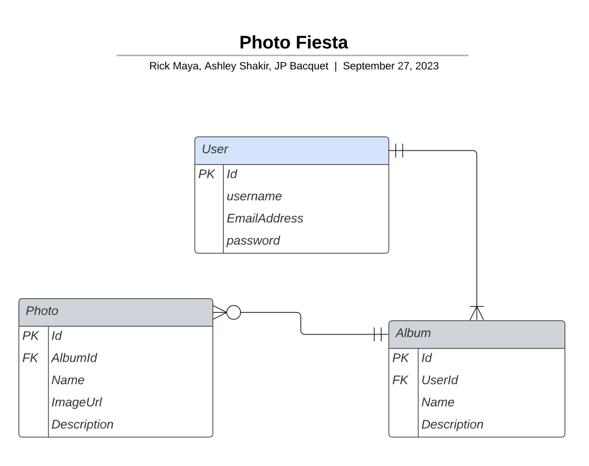

# Photo Fiesta Application
## Project Description
Photo Fiesta is a monolithic backend developed using Spring Boot that provides a RESTful API which allows users to upload photos and organize them into albums. Users can register and login to take advantage of the photo managament system.    
**Status**: :construction: Under Development :construction:
## User Stories

  
User Registration and Login

  <strong>User Story</strong>: As a new user, I want to be able to register for an account with an email and password.  
  <strong>Acceptance Criteria</strong>: Given I am a new user, when I register, then my account is created.    
  <strong>User Story</strong>: As a registered user, I want to be able to login to my account securely.   
  <strong>Acceptance Criteria</strong>: Given I am a registered user, when I login with my correct email and password, then I have access to the application features.    

  
User Album Management

  <strong>User Story</strong>: As a logged in user, I want to create a new album so that I can organize my photos.  
  <strong>Acceptance Criteria</strong>: Given I am a logged in user, when I create a new album, then it is added to my photo album collection.    
  <strong>User Story</strong>: As a logged in user, I want to edit the title and description of an album so that I can modify it.  
  <strong>Acceptance Criteria</strong>: Given I am a logged in user, when I edit the title and description of an album, then the album is updated.    
  <strong>User Story</strong>: As a logged in user, I want to delete an album that is no longer needed.  
  <strong>Acceptance Criteria</strong>: Given I am a logged in user, when I delete an album, then the album is deleted.    
  <strong>User Story</strong>: As a logged in user, I want to view one or  all of my albums.  
  <strong>Acceptance Criteria</strong>: Given a list of albums is available, when I want to view my albums, then the list of albums is displayed.  
  <strong>Acceptance Criteria</strong>: Given a list of albums is available, when I want to view a specific album, then the correct album is displayed.    

  
User Photo Management

  <strong>User Story</strong>: As a logged in user, I want to be able to add a photo to an album. 
  <strong>Acceptance Criteria</strong>: Given I am logged in user, when I add a photo to an album, then the photo is added.   
  <strong>User Story</strong>: As a logged in user, I want to be able to delete a photo from an album. 
  <strong>Acceptance Criteria</strong>: Given I am a logged in user, when I delete a photo from an album, then the photo is deleted.   
  <strong>User Story</strong>: As a logged in user, I want to be able to update the album that the photo is in.  
  <strong>Acceptance Criteria</strong>: Given I am a logged in user, when I update a photo from an album, then the photo is updated.   
  <strong>User Story</strong>: As a logged in user, I want to edit the title and description of a photo so that I can modify it.  
  <strong>Acceptance Criteria</strong>: Given I am a logged in user, when I edit  the title and description of a photo, then the photo is updated.   
  <strong>User Story</strong>: As a logged in user, I want to view one or all photos in an album. 
  <strong>Acceptance Criteria</strong>: Given a list of photos is available in the specified album, when I want to view all photos, then all of the photos are displayed 
  <strong>Acceptance Criteria</strong>: Given a list of photos is available in the specified album, when I want to view a specific photo, then the correct photo is displayed.   

## ERD Diagram

## REST API Endpoints
| Endpoint     | Request Type | URL                            | Functionality                                      | Access              |
|--------------|--------------|--------------------------------|----------------------------------------------------|---------------------|
| Register     | POST         | `/auth/users/register/`         | Registers a new user with the provided user data. | Public              |

