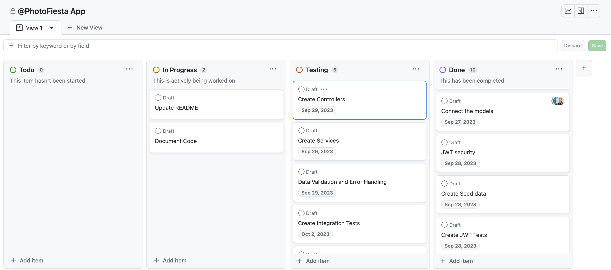

# Photo Fiesta Application

## Project Description
Photo Fiesta is a monolithic backend developed using Spring Boot that provides a RESTful API which allows users to upload photos and organize them into albums. Users can register and login to take advantage of the photo management system.
## Table of Contents
- [Features](#features)
- [Tools and Technologies Used](#tools-and-technologies-used)
- [Project Approach](#project-approach)
- [Agile Development](#agile-development)
- [Entity-Relationship Diagram (ERD)](#entity-relationship-diagram-erd)
- [REST API Endpoints with OpenAPI Documentation](#rest-api-endpoints-with-openapi-documentation)
- [Hurdles Encountered During Development](#hurdles-encountered-during-development)
- [Installation Instructions](#installation-instructions)
- [Acknowledgements](#acknowledgements)
## Features
### User Authentication and Authorization
- Register new users.
- Login with email and password.
- JWT-based authentication for enhanced security.

### Album and Photo Management
- Create and delete albums.
-  Add, update, and delete photos within albums.
- View all and individual photos within albums.

## Tools and Technologies Used
- **Spring Boot:** Powers the backend.
- **H2 Database:** Manages data storage.
- **Spring Security:** Ensures data security.
- **JWT Tokens:** Provides authentication and authorization.
- **Tomcat Server:** Hosts the application.
- **MVC Architecture:** Follows a clean code structure.
- **Documentation:** Well-documented codebase.
- **GitHub:** Version control and collaboration platform.
- **Spring RESTful API:** Offers user-friendly interaction.
- **SpringDoc OpenAPI** Generates OpenAPI documentation for API endpoints.
- **Swagger UI** Interactive user interface for exploring and testing API.

## Project Approach 
Our team adopted a systematic and collaborative approach to building this photo management backend application. The core idea behind Photo Fiesta is to create a user-friendly platform for uploading photos and managing them within albums. To achieve this, we've broken down our project approach into several key components:

### User-Centric Design
Our project starts with a focus on user stories, ensuring that every feature and functionality is designed with the end-users in mind. We've carefully crafted user stories to capture the essential interactions users will have with Photo Fiesta, from registration and login to album and photo management.
<details>
  <summary>User Registration and Login</summary>
  <strong>User Story</strong>: As a new user, I want to be able to register for an account with an email and password. <br>
  <strong>Acceptance Criteria</strong>: Given I am a new user, when I register, then my account is created. <br> <br>
  <strong>User Story</strong>: As a registered user, I want to be able to login to my account securely. <br> 
  <strong>Acceptance Criteria</strong>: Given I am a registered user, when I login with my correct email and password, then I have access to the application features. <br> <br>
</details>
<details>
  <summary>User Album Management</summary>
  <strong>User Story</strong>: As a logged in user, I want to create a new album so that I can organize my photos. <br>
  <strong>Acceptance Criteria</strong>: Given I am a logged in user, when I create a new album, then it is added to my photo album collection. <br> <br>
  <strong>User Story</strong>: As a logged in user, I want to edit the title and description of an album so that I can modify it. <br>
  <strong>Acceptance Criteria</strong>: Given I am a logged in user, when I edit the title and description of an album, then the album is updated. <br> <br>
  <strong>User Story</strong>: As a logged in user, I want to delete an album that is no longer needed. <br>
  <strong>Acceptance Criteria</strong>: Given I am a logged in user, when I delete an album, then the album is deleted. <br> <br>
  <strong>User Story</strong>: As a logged in user, I want to view one or  all of my albums. <br>
  <strong>Acceptance Criteria</strong>: Given a list of albums is available, when I want to view my albums, then the list of albums is displayed. <br>
  <strong>Acceptance Criteria</strong>: Given a list of albums is available, when I want to view a specific album, then the correct album is displayed. <br> <br>
</details>
<details>
  <summary>User Photo Management</summary>
  <strong>User Story</strong>: As a logged in user, I want to be able to add a photo to an album.<br>
  <strong>Acceptance Criteria</strong>: Given I am logged in user, when I add a photo to an album, then the photo is added. <br><br>
  <strong>User Story</strong>: As a logged in user, I want to be able to delete a photo from an album.<br>
  <strong>Acceptance Criteria</strong>: Given I am a logged in user, when I delete a photo from an album, then the photo is deleted. <br><br>
  <strong>User Story</strong>: As a logged in user, I want to be able to update the album that the photo is in. <br>
  <strong>Acceptance Criteria</strong>: Given I am a logged in user, when I update a photo from an album, then the photo is updated. <br><br>
  <strong>User Story</strong>: As a logged in user, I want to edit the title and description of a photo so that I can modify it. <br>
  <strong>Acceptance Criteria</strong>: Given I am a logged in user, when I edit  the title and description of a photo, then the photo is updated. <br><br>
  <strong>User Story</strong>: As a logged in user, I want to view one or all photos in an album.<br>
  <strong>Acceptance Criteria</strong>: Given a list of photos is available in the specified album, when I want to view all photos, then all of the photos are displayed<br>
  <strong>Acceptance Criteria</strong>: Given a list of photos is available in the specified album, when I want to view a specific photo, then the correct photo is displayed.<br> <br>
</details>

### Agile Development
We've embraced Agile methodologies to facilitate rapid development and adaptation to changing requirements. Our project is divided into phases, each with specific objectives. This iterative approach allows us to deliver incremental updates and maintain flexibility throughout development. As part of our Agile approach, we have created a GitHub project board that serves as a dynamic and visual tool to manage our project's progress.

You can explore our [GitHub Project Board](https://github.com/users/jeanpolbac/projects/2/views/1) to gain insights into our project's progress and see how we organize and prioritize tasks.


### Entity-Relationship Diagram (ERD)
To model our data structure effectively, we've created an Entity-Relationship Diagram (ERD). This visual representation maps out the relationships between different entities in our system, such as users, albums, and photos. The ERD serves as a blueprint for our database design, ensuring that data is organized and structured efficiently.


### REST API Endpoints with OpenAPI Documentation
Our application's functionality is exposed through a set of REST API endpoints. These endpoints are meticulously designed to provide users with seamless access to Photo Fiesta's features, and they are accompanied by comprehensive OpenAPI documentation. You can explore and test these endpoints interactively using the [Swagger UI](http://localhost:9095/swagger-ui.html).

Here's a glimpse of some of the key API endpoints:

| Endpoint                             | Request Type | URL                                      | Functionality                             | Access    |
|--------------------------------------|--------------|------------------------------------------|-------------------------------------------|-----------|
| Register                             | POST         | `/auth/users/register/`                 | Registers a new user with user data.      | Public    |
| Logs a user in                       | POST         | `/auth/users/login/`                    | Logs a user in.                          | Public    |
| Create a new album                   | POST         | `/api/albums/`                           | Create a new album.                      | Private   |
| Delete an existing album by ID       | DELETE       | `/api/albums/1/`                         | Delete an existing album by ID.          | Private   |
| Create a photo inside of an album    | POST         | `/api/albums/1/photos/`                  | Create a photo inside an album.           | Private   |
| Get one photo from album by ID       | GET          | `/api/albums/1/photos/1/`                | Get one photo from album by ID.           | Private   |
| Get all photos in an album by album ID| GET          | `/api/albums/{albumId}/photos/`          | Get all photos in an album by album ID.  | Private   |
| Update a photo inside an album by ID | PUT          | `/api/albums/1/photos/1/`                | Update a photo inside an album by ID.     | Private   |
| Delete an existing photo from album  | DELETE       | `/api/albums/1/photos/1/`                | Delete an existing photo from album by ID.| Private   |

These endpoints represent the core interactions that users will have with Photo Fiesta, from user registration to album and photo management.

### Branch-Based Collaboration
To foster efficient teamwork, we've established a branch-based collaboration strategy. Different team members work on specific aspects of the project, such as models, security, and endpoints, within dedicated branches. Regular merges to the dev branch ensure that our codebase remains cohesive.

### Comprehensive Testing
To maintain code quality and reliability, we've integrated Cucumber testing into our development process. We perform extensive testing, including public and protected endpoint testing, token testing, and thorough unit testing of service and controller components.

## Hurdles Encountered During Development

- **Merge Conflicts:** We faced merge conflicts while fetching from our remote repository. These conflicts were related to issues with the .idea folder in IntelliJ and the DS_Store file on macOS. To resolve this, we added the DS_Store file to the gitignore file and updated the SDK Language to version 17, ensuring consistency among team members.
- **Creating Cucumber Testing Step Definitions:** We encountered a challenge in creating step definitions for Cucumber testing. To overcome this, we needed to invalidate caches from IntelliJ IDE, enabling smoother progress in our testing efforts.
- **Testing Public Endpoints:** Determining the most effective approach to test whether a given endpoint is a valid public endpoint posed a challenge. We decided to use an assertFalse method to check that the status code is not equal to code 403, indicating that the endpoint had been reached.
- **Creating a Default Album:** We struggled with establishing the logic to automatically save a default album in a user's album list when they register for an account. To address this, we updated the User Service createUser() method to initialize the list of albums, create a default album and save it to the album repository, and add it to the user's initialized album list, successfully resolving this hurdle.

## Installation Instructions

To get started with Photo Fiesta and install its dependencies, follow these steps:

1. **Install Maven:** Make sure you have Maven installed on your system. You can check if it's installed by running the following command in your terminal or command prompt:

   ```bash
   mvn -v 
   ```
   If Maven is not installed, you can download and install it from the official [Apache Maven](https://maven.apache.org/download.cgi) website.

2. Navigate to the root directory of your project, where your pom.xml file is located.
3. Open a terminal or command prompt in this directory and run the following Maven command to download and install the project dependencies:
   ```bash
   mvn clean install
   ```
   This command will instruct Maven to resolve all the dependencies listed in your pom.xml file and download them from the central Maven repository. It will also build your project.

4. Once the command completes successfully, your project should be ready with all its dependencies installed.

## Acknowledgements
### Development Team
 - Ashley Shakir: [GitHub](https://github.com/ashleyshakir) | [LinkedIn](https://www.linkedin.com/in/ashleymshakir/)
 - JP Bacquet: [Github](https://github.com/jeanpolbac) | [LinkedIn](https://www.linkedin.com/in/jpbacquet/)
 - Rick Maya: [GitHub](https://gist.github.com/rickstylz01) | [LinkedIn](https://www.linkedin.com/in/rickmaya/)

### General Assembly Instructors
- Suresh Sigera: [GitHub](https://github.com/sureshmelvinsigera)
- Dhrubo Chowdhury
- Leonardo Rodriguez


